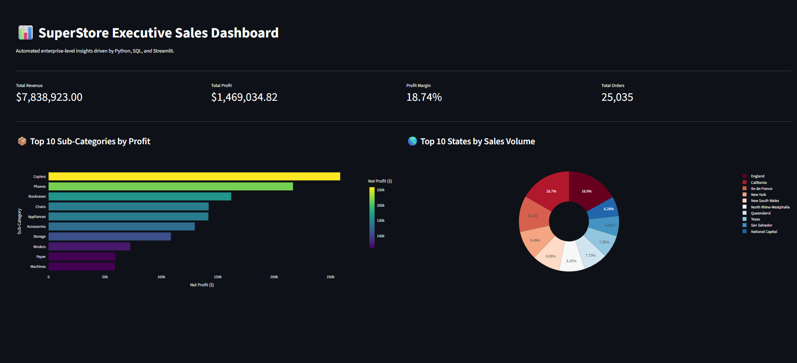

# SuperStore Executive Sales Analytics Dashboard

An enterprise-level data analytics solution designed to ingest, process, and visualize retail sales performance. This project features a robust **SQL-driven ETL pipeline** paired with an interactive **Python Streamlit dashboard** to deliver automated, actionable business insights.

## 📊 Dashboard Preview


---

## 🛠️ Tech Stack & Architecture
* **Frontend Dashboard:** Streamlit (Python)
* **Data Visualization:** Plotly Express (Interactive charts)
* **Database Engine:** SQLite3
* **Data Manipulation:** Pandas & NumPy
* **Source Version Control:** Git & GitHub

---

## ⚙️ Key Architectural Features

### 1. Embedded Data Warehousing (SQLite)
* Designed and queried structured tables using optimized local relational storage.
* Engineered complex analytical SQL queries utilizing aggregations (`SUM`, `COUNT DISTINCT`), rounding, and group segments to isolate key retail metrics dynamically.

### 2. High-Performance Caching
* Integrated Streamlit’s native `@st.cache_data` engine to isolate connection logic and memory usage.
* Implemented caching mechanisms to minimize redundant database round-trips, ensuring instantaneous frontend loading states.

### 3. Production Security Standards
* Implemented rigorous environment variable isolation utilizing `.env` modules.
* Maintained clean repository tracking by establishing data protection rules within `.gitignore` to prevent database and credential leaks.

---

## 🚀 Local Installation & Execution

To run this analytics system locally, execute the following commands in your terminal:

1. **Clone the repository:**
   ```bash
   git clone [https://github.com/Dr-fredrick/superstore-sales-analytics.git](https://github.com/Dr-fredrick/superstore-sales-analytics.git)
   cd superstore-sales-analytics
   pip install streamlit plotly pandas
   streamlit run app.py
